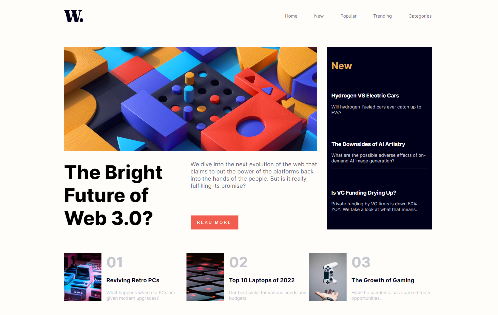

# Frontend Mentor - News homepage

## The challenge

Your users should be able to:

- View the optimal layout for the interface depending on their device's screen size
- See hover and focus states for all interactive elements on the page
- **Bonus**: Toggle the mobile menu (requires some JavaScript)

## Built with:

- HTML5
- CSS
- CSS Grid
- CSS Flexbox
- JavaScript

## Live site URL: